<!-- _class: title -->

# Safe Scala meets Dapr

## Distributed systems the compiler can prove correct

**dapr4s** — a capability-safe Scala 3 wrapper for the Distributed Application Runtime

<br>

`github.com/sideeffffect/dapr4s` · examples in `dapr4s-examples`

---

## Where we're going

1. **The problem** — distributed systems are effects all the way down
2. **Dapr** — the sidecar that absorbs the hard parts
3. **Safe Scala** — capture checking, capabilities, safe mode
4. **dapr4s** — design: pure core + impure shell
5. **Eleven worked examples** — state, secrets, pub/sub, invocation, locks, actors, workflows, cryptography, jobs, conversation, bindings
   - plus **two real-world case studies** — Grafana scan pipeline, ZEISS order saga
6. **The payoff** — what the compiler now guarantees
7. **Trade-offs, status, and where this goes next

---

<!-- _class: section-break -->

# Part 1
## The problem

---

## The real enemy is complexity

> *"Complexity is the single major difficulty in the successful development
> of large-scale software."* — Moseley & Marks, **Out of the Tar Pit** (2006)

Two kinds — and we routinely confuse them:

- **Essential** — inherent in the problem (an order must be paid before it ships)
- **Accidental** — what *we* drag in to make it run (clients, retries, wiring, lifetimes)

Their two chief sources of *accidental* complexity:

- **State** — you can't reason about a value without the whole history that produced it
- **Control** — *how* and *when* code runs, tangled into *what* it computes

> The goal isn't to delete complexity — it's to stop **adding** it, and to make
> what remains **visible**. This talk attacks both: a runtime and a type system.

---

## Microservices: the same five concerns, every time

Every service that talks to another service re-implements:

- **Service discovery** — where is `inventory-service` right now?
- **Retries & timeouts** — the network is not reliable
- **State** — key/value, with optimistic concurrency
- **Messaging** — pub/sub, at-least-once delivery, dead-letters
- **Security** — mTLS, identity, secret distribution

Each language/framework solves these *differently and incompletely*.

> The accidental complexity dwarfs the business logic.

---

## The plumbing every call drags along

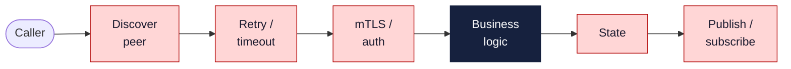

A sliver of **business logic** (dark) buried in **five red plumbing concerns** —
re-solved in every service, in every language. Dapr lifts the red boxes out.

---

## And in the code, effects hide in plain sight

```scala
val client = StateClient.connect(...)   // a resource — must be closed
client.save("k", v)                      // I/O — can fail, can block
// ... 200 lines later ...
process(client)                          // is this still open? who knows.
```

The compiler sees `client` as an ordinary value:

- Nothing stops you using it **after it's closed**
- Nothing stops you **smuggling it out** of its scope into a callback
- Nothing records that this function **performs I/O** at all

**Runtime discipline** ("just don't do that") is the only guardrail.

---

## Two questions this talk answers

<div class="columns">
<div>

### How do we tame the distributed plumbing?

→ **Dapr**: push discovery, retries, state, messaging, mTLS into a
language-agnostic **sidecar**.

</div>
<div>

### How do we make the *effects* visible to the compiler?

→ **Safe Scala**: model each Dapr capability as a tracked
`Capability` that **cannot leak** past its scope.

</div>
</div>

<br>

**dapr4s** is where the two meet — Dapr lifts out the accidental complexity of
*distribution*; Safe Scala attacks the accidental complexity of *state and
control* by pinning both to the types.

---

<!-- _class: section-break -->

# Part 2
## Dapr in five minutes

---

## What is Dapr?

**Dapr** = **D**istributed **App**lication **R**untime.

A portable, event-driven runtime for resilient microservices.

- **Language- & framework-agnostic** — APIs over plain HTTP/gRPC
- **Runs as a sidecar**, not a library embedded in your app
- Backends ("components") are **swappable YAML** — Redis today, Cosmos DB tomorrow, no code change
- **Secure by default** — mTLS between sidecars, automatic cert rotation

Audited by Cure53 and Ada Logics; a CNCF graduated project.

---

## The sidecar pattern

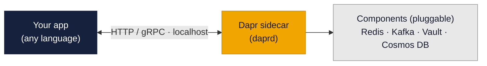

Your app speaks to **`localhost`**. The sidecar handles discovery, retries,
mTLS, tracing, and the actual backend. Swap the backend, keep the code.

---

## Building blocks: capabilities as HTTP/gRPC APIs

| Building block | Endpoint | Status |
|---|---|---|
| Service Invocation | `/v1.0/invoke` | Stable |
| Publish / Subscribe | `/v1.0/publish` · `/subscribe` | Stable |
| State Management | `/v1.0/state` | Stable |
| Actors | `/v1.0/actors` | Stable |
| Workflows | `/v1.0/workflow` | Stable |
| Secrets | `/v1.0/secrets` | Stable |
| Configuration | `/v1.0/configuration` | Stable |
| Distributed Lock | `/v1.0-alpha1/lock` | Alpha |
| Bindings | `/v1.0/bindings` | Stable |
| Cryptography | `/v1.0-alpha1/crypto` | Alpha |
| Jobs | `/v1.0-alpha1/jobs` | Alpha |
| Conversation | `/v1.0-alpha2/conversation` | Alpha |

**dapr4s wraps all twelve as type-safe Scala capabilities.**

---

## Application identity & security

- Every app has a unique **App ID** — the atomic unit of identity
  - Drives **service discovery** (you invoke by name, not IP)
  - Scopes state keys; drives access-control lists
- **mTLS is on by default** between sidecars
  - **Sentry** service is the CA: 24-hour workload certs, auto-rotated
- Topic scoping, secret scoping, API allow-lists

You get the security posture *without writing security code*.

---

<!-- _class: section-break -->

# Part 3
## Safe Scala

---

## The silent safety gap (this compiles, then crashes)

```scala
def usingLogFile[T](op: FileOutputStream => T): T =
  val logFile = FileOutputStream("log")
  val result = op(logFile)
  logFile.close()
  result

val later = usingLogFile { file => () => file.write(0) }
later()  //  boom — file already closed
```

The resource **escaped** its scope inside a closure.
Classic try-with-resources cannot catch this. **The type system should.**

---

## Capture checking: attach capabilities to types

Scala 3's experimental **capture checking** tracks *which capabilities a value
retains* — statically, with zero runtime cost.

```scala
def usingLogFile[T](op: FileOutputStream^ => T): T = ...

// val later = usingLogFile { f => () => f.write(0) }
//   compile error: f cannot escape the scope it was given in
```

`FileOutputStream^` means "a stream that **carries a capability**".
The compiler refuses to let it outlive the block that owns it.

```scala
//> using options "-language:experimental.captureChecking"
```

---

## The capturing-types vocabulary

| Notation | Meaning |
|---|---|
| `T` or `T^{}` | **Pure** — retains no capabilities |
| `T^{c}` | Retains capability `c` |
| `T^{c1, c2}` | Retains both |
| `T^` | Retains *arbitrary* capabilities (top) |

Subtyping follows the capture set — **fewer captures = more usable**:

```
A  <:  A^{c}  <:  A^{c, d}  <:  A^
```

Function arrows encode it too: `A -> B` is pure; `A => B` may capture anything.

---

## Capabilities & escape checking

A **capability** is a value of interest — a file handle, a token, a
client connection. A type becomes a capability by extending
`scala.caps.Capability` (or `Exclusive`/`Shared` variants).

**Escape checking** is the core rule:

> A capture set may only mention capabilities **visible where the set is
> defined.** A local capability cannot appear in a type that outlives it.

That single rule turns "don't use the client after close" from a code-review
comment into a **compile error**.

---

## `ExclusiveCapability` — dapr4s's workhorse

Every dapr4s capability extends `scala.caps.ExclusiveCapability`:

```scala
trait StateCapability extends scala.caps.ExclusiveCapability:
  def save[T](key: StateKey, value: T)(using JsonCodec[T]): Unit
  def get[T](key: StateKey)(using JsonCodec[T]): Option[T]
  ...
```

**Exclusive** means: no aliasing, no sharing across threads, single owner.
The compiler will reject capturing it in a lambda handed to another thread —
exactly the discipline distributed clients need.

---

## Safe mode: a hardened language subset

Compile a module with `-language:experimental.safe` and you opt into
**six restrictions** that close every capability-laundering loophole:

| Restriction | Blocks |
|---|---|
| No unsafe casts | `asInstanceOf`, unchecked matches |
| No `caps.unsafe` | the escape-hatch modules |
| No `@unchecked` | suppressing checks |
| No reflection | `scala.reflect`, `java.lang.reflect` |
| Effect tracking required | must compile with capture checking |
| Safe deps only | may only call other safe-compiled code |

> The type checker *becomes* the security boundary. (This is the same
> mechanism EPFL proposes for sandboxing AI-agent-generated code.)

---

## The `@assumeSafe` escape hatch

Real code must cross boundaries safe mode can't see — the Java Dapr SDK,
upickle's macro derivation. `@scala.caps.assumeSafe` says:

> *"I assert this boundary is safe — trust me, and stop checking here."*

```scala
@scala.caps.assumeSafe
given JsonCodec[Note] = upickleCodec(using upickle.default.macroRW)
```

The whole strategy: **a small, audited trusted core** marked `@assumeSafe`,
behind which **all user code stays fully checked.** In the examples,
`@assumeSafe` appears in *exactly one place per shell* — the JSON codec.

---

<!-- _class: section-break -->

# Part 4
## dapr4s — the design

---

## Pure core + impure shell

Every example is **two Mill modules**:

<div class="columns">
<div>

### `name` (pure)
`-language:experimental.safe`

- Business logic only
- No I/O, no `println`
- Returns structured result types
- Capabilities arrive as `using` params

</div>
<div>

### `name-shell` (impure)
`-experimental`

- Derives JSON codecs (macros)
- Starts `Dapr(...).run`
- Prints, reads env, sleeps
- Calls into the pure core

</div>
</div>

The boundary is the point: **untrusted-style logic is checked; messy
real-world glue is quarantined in the shell.**

This *is* the Tar Pit prescription — **separate the essential from the
accidental** — but enforced by the compiler, not by discipline.

---

## The boundary, visualized

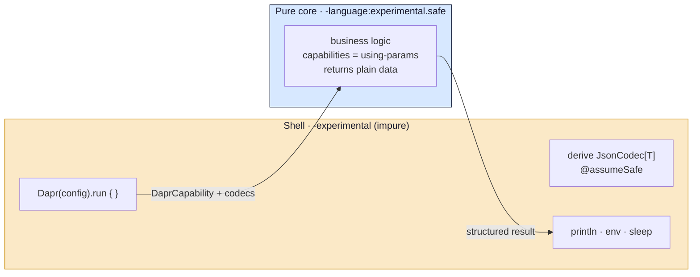

Codecs and I/O stay outside; the checked core only ever sees typed capabilities
and returns data. **Macros and side effects never cross into safe code.**

---

## `DaprCapability` — the root capability

`Dapr(config).run { ... }` puts a `DaprCapability` in scope. It's a **factory**
for every sub-capability — and it *cannot outlive the run block*:

```scala
trait DaprCapability extends scala.caps.ExclusiveCapability:
  def state(storeName: StoreName): StateCapability^{this}
  def pubsub(pubsubName: PubSubName): PubSubCapability^{this}
  def invoker: ServiceInvocationCapability^{this}
  def secrets(storeName: SecretStoreName): SecretsCapability^{this}
  def lock(storeName: StoreName): DistributedLockCapability^{this}
  def actor(t: ActorType, id: ActorId): ActorCapability^{this}
  def workflow: WorkflowCapability^{this}
```

`^{this}` is the magic: each sub-capability is captured by the root, so it
inherits the root's lifetime — **no sub-capability can escape `run`.**

---

## Capability lifetimes, visualized

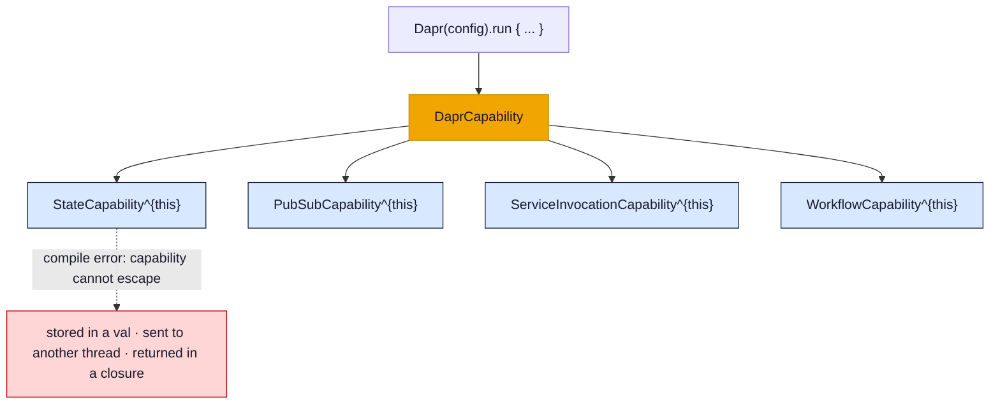

Every sub-capability carries `^{this}` — the root's lifetime. Try to smuggle one
past the `run` block and the program **does not compile.**

---

## The transformer API — capabilities you never name

Rather than juggling `given` values, the companion object opens a **scope**
and threads the capability implicitly via a context function (`?=>`):

```scala
object HelloStateApp:                              // the pure entry point
  def apply()(using DaprCapability, JsonCodec[Note]): HelloStateResult =
    DaprCapability.state(StoreName("statestore")):
      StateCapability.save(key, Note("Hello!", 1)) // capability is ambient
      StateCapability.get[Note](key)
    // ← StateCapability is GONE here. Touching it is a compile error.
```

```scala
def state(store: StoreName)[T](body: StateCapability ?=> T)
                              (using cap: DaprCapability): T =
  body(using cap.state(store))
```

Open a scope → use the capability → it's reclaimed at the brace. Guaranteed.

---

## Opaque types: parse, don't validate

dapr4s never passes a bare `String` where a domain concept belongs:

```scala
StoreName("statestore")   ActorType("CounterActor")   Topic("hello-topic")
StateKey("hello-note")    AppId("greeting-service")    MethodName("greet")
```

These are **opaque types** — zero runtime cost, but the compiler won't let you
pass a `Topic` where a `StoreName` is expected. *Primitive obsession,
eliminated.* (~30 such types across the library.)

```scala
opaque type StoreName = String
object StoreName:
  def apply(s: String): StoreName = s   // smart constructor
```

---

## `JsonCodec[T]` — derivation stays in the shell

Serialization is a typeclass; macro derivation is *impure*, so it lives in the
shell and is **passed into the pure core** as a `using` parameter:

```scala
// shell — impure, @assumeSafe boundary
@scala.caps.assumeSafe
given JsonCodec[Note] = upickleCodec(using upickle.default.macroRW)

// pure core — receives the codec, never derives it
object HelloStateApp:
  def apply()(using DaprCapability, JsonCodec[Note]): HelloStateResult
```

One small typeclass over upickle — no effect-library dependency, blocking API
under the hood (`.block()` on the SDK's `Mono`/`Flux`).

---

<!-- _class: section-break -->

# Part 5
## Eleven worked examples

---

## Example map

| # | Building block | Safe-Scala highlight |
|---|---|---|
| 1 | State CRUD, ETag, txns | capability can't outlive its scope |
| 2 | Secrets + live config | multiple capabilities at once |
| 3 | Pub/Sub | handler capture tracked across the boundary |
| 4 | Service invocation | typed `InvocationRoute` request/response |
| 5 | Distributed lock | exclusive capability ⇒ try/unlock pairing |
| 6 | Virtual actors | per-invocation `ActorContext` |
| 7 | Durable workflows | `Task[O]` can't be awaited outside the run |
| 8 | Cryptography | encrypt/decrypt scoped to a `CryptoCapability` |
| 9 | Jobs | schedule client + `JobRoute` handler, two halves |
| 10 | Conversation | alpha1 + alpha2 on one capability |
| 11 | Bindings | output + input on one bidirectional connector |

Each is a `pure` + `shell` module pair you can `dapr run`. Examples **12** and
**13** are the two real-world case studies that close the deck (Grafana scan
pipeline, ZEISS order saga).

---

## 1 · Hello State — the core loop

```scala
object HelloStateApp:
  def apply()(using DaprCapability, JsonCodec[Note]): HelloStateResult =
    DaprCapability.state(StoreName("statestore")):
      val key = StateKey("hello-note")
      StateCapability.save(key, Note("Hello from dapr4s!", 1))
      val saved = StateCapability.get[Note](key)

      val entry = StateCapability.getWithETag[Note](key)       // optimistic
      val etagConflict = (entry.value, entry.etag) match
        case (Some(n), Some(etag)) =>
          StateCapability.saveWithETag(key, n.copy(text = "Updated!"), etag)
        case _ => None
      ...
```

State CRUD, **ETag-guarded** concurrency, and atomic transactions — all inside
one capability scope. The whole function is `safe`-compiled: **no I/O leaks.**

---

## 1 · Hello State — transactions & the boundary

```scala
    StateCapability.transaction(Seq(
      StateOp.UpsertOp[Note](StateKey("note-a"), Note("A", 1)),
      StateOp.UpsertOp[Note](StateKey("note-b"), Note("B", 1)),
      StateOp.DeleteOp(key),
    ))
    val bulk = StateCapability.getBulk[Note](Seq(StateKey("note-a"), ...))
    HelloStateResult(saved, etagConflict, afterUpdate, ...)
```

The pure function returns a **plain data record**. The shell prints it:

```scala
Dapr(daprConfigFromEnv()).run:
  val r = HelloStateApp()
  println(s"saved: ${r.saved}")
```

`UpsertOp` pre-encodes its value at construction — illegal ops can't be built.

---

## 2 · Secrets + Configuration — several capabilities

```scala
def readSecrets()(using DaprCapability): (Option[SecretValue], Seq[String]) =
  DaprCapability.secrets(SecretStoreName("secretstore")):
    val apiKey  = SecretsCapability.get(SecretKey("MY_API_KEY"))
    val allKeys = SecretsCapability.getBulk().keys.map(_.value).toSeq.sorted
    (apiKey, allKeys)

def readConfig()(using DaprCapability): Map[ConfigKey, ConfigItem] =
  DaprCapability.config(ConfigStoreName("configstore")):
    ConfigurationCapability.get(configKeys)
```

Two independent scopes from the same root. **Live config subscription**
(a callback + `sleep`) is inherently impure — so it stays in the shell, not here.

---

## 3 · Pub/Sub — capture across the handler boundary

```scala
def onMessage(event: CloudEvent[Message])
             (using PubSubCapability, JsonCodec[Message]): SubscriptionResult =
  PubSubCapability.publish(Topic("hello-replies"), event.data.copy(from = "subscriber"))
  SubscriptionResult.Success

object SubscriberApp:
  def apply()(using DaprCapability, JsonCodec[Message]): DaprApp =
    DaprCapability.pubsub(PubSubComponent):
      DaprApp(subscriptions = List(
        Subscription[Message](PubSubComponent, MessageTopic)(onMessage)
      ))
```

The handler **captures** `PubSubCapability`; the compiler tracks that capture
all the way to `Subscription`. Messages arrive as typed **`CloudEvent[Message]`** —
no manual envelope parsing.

---

## 4 · Service Invocation — typed routes (callee)

```scala
def greet(req: GreetRequest)(using StateCapability, JsonCodec[ServiceStats]): GreetResponse =
  val greeting = req.language match
    case "es" => s"¡Hola, ${req.name}!"
    case "fr" => s"Bonjour, ${req.name}!"
    case _    => s"Hello, ${req.name}!"
  val current = StateCapability.get[ServiceStats](StatsKey).getOrElse(ServiceStats(0, Nil))
  StateCapability.save(StatsKey, current.copy(count = current.count + 1))
  GreetResponse(greeting, from = "greeting-service")

object CalleeApp:
  def apply()(using DaprCapability, ...): DaprApp =
    DaprCapability.state(StatStore):
      DaprApp(invocations = List(
        InvocationRoute[GreetRequest, GreetResponse](MethodName("greet"))(greet),
        InvocationRoute[Unit, StatsResponse](MethodName("stats"))(_ => stats()),
      ))
```

`InvocationRoute[In, Out]` ties the wire contract to the handler's *types*.

---

## 4 · Service Invocation — the caller

```scala
object CallerApp:
  def apply()(using DaprCapability, ...): CallerResult =
    DaprCapability.invoker:
      val target = AppId("greeting-service")
      val greetings = requests.map: req =>
        ServiceInvocationCapability
          .invoke[GreetRequest](target, MethodName("greet"), req, HttpMethod.Post)[GreetResponse]
      val s = ServiceInvocationCapability.invoke[StatsResponse](target, MethodName("stats"))
      CallerResult(greetings, s)
```

- Call by **`AppId`**, not host:port — Dapr resolves it, over mTLS
- `invoke[In](...)[Out]` — request and response types are both explicit
- No client to close — the `invoker` capability is reclaimed at the scope end

---

## 5 · Distributed Lock — exclusivity enforced

```scala
object DistributedLockApp:
  def apply(lockExpiry: FiniteDuration, shortExpiry: FiniteDuration)  // built in the shell
           (using DaprCapability, JsonCodec[Int]): LockDemoResult =
    DaprCapability.state(StoreName("statestore")):
      DaprCapability.lock(StoreName("lockstore")):
        val resource = LockResourceId("my-resource")
        for i <- 1 to N do
          val owner = LockOwner(s"worker-$i")
          if DistributedLockCapability.tryLock(resource, owner, expiry = lockExpiry) then
            try
              val v = StateCapability.get[Int](counter).getOrElse(0)
              StateCapability.save(counter, v + 1)
            finally DistributedLockCapability.unlock(resource, owner)
```

`DistributedLockCapability` is **exclusive** — the compiler forbids handing it
to another thread's closure. Lock/unlock pairing is structural (`try/finally`).
`expiry` is a `FiniteDuration` built in the shell (safe code can't construct one).

---

## 5 · Distributed Lock — proving mutual exclusion

```scala
      val secondAcquire =
        if DistributedLockCapability.tryLock(resource, ownerA, expiry = lockExpiry) then
          val second = DistributedLockCapability.tryLock(resource, ownerB, expiry = shortExpiry)
          DistributedLockCapability.unlock(resource, ownerA)
          second          // false — B can't acquire while A holds it
        else false

      val afterRelease = DistributedLockCapability.tryLock(resource, ownerB, expiry = lockExpiry)
      // true — now that A released, B succeeds
```

The example *demonstrates* the semantics: second acquire fails, post-release
acquire succeeds. Counter ends at exactly `N` — no lost updates.

---

## 6 · Virtual Actors — `ActorContext` per invocation

```scala
def increment(req: IncrBy)(using ActorContext, JsonCodec[Int]): CounterState =
  val s = readState
  ActorContext.set(StateKey_Count, s.count + req.amount)
  ActorContext.set(StateKey_Total, s.totalIncrements + 1)
  readState
```

- **Virtual actor** = single-threaded, turn-based, state-isolated entity
- `ActorContext` is a **per-invocation exclusive capability** — it cannot be
  captured in a value that outlives the handler
- All state flows through `ActorContext.get` / `.set` — never a shared field

---

## 6 · Actors — wiring methods, timers, reminders

```scala
ActorDefinition(ActorTypeName): id =>
  // build is `ActorId => ActorContext ?=> ActorRoutes`, so ActorContext is implicit here
  ActorRoutes(
    methods = List(
      ActorMethodRoute[IncrBy, CounterState](MethodName("increment"))(increment),
      ActorMethodRoute[Unit, CounterState](MethodName("get"))(_ => readState),
      ActorMethodRoute[Unit, CounterState](MethodName("startTimer")): _ =>
        ActorContext.registerTimer(AutoTimer, IncrBy(1), tickInterval, tickDelay)
        readState,
    ),
    timers    = List(ActorTimerRoute[IncrBy](AutoTimer)(onAutoTick)),
    reminders = List(ActorReminderRoute[String](ResetReminder)(onReset)),
  )
```

**Timers** (in-memory, actor-lifetime) and **reminders** (durable, survive
restarts) are first-class, typed routes — same model as methods.

---

## 7 · Workflows — a saga with compensation

```scala
class OrderProcessingWorkflow(using ...) extends Workflow:
  def run(using WorkflowContext): Unit =
    val order = WorkflowContext.getInput[OrderRequest].getOrElse(throw ...)
    val reservation = WorkflowContext.callActivity[ReserveInventory](order).await()
    if !reservation.reserved then
      WorkflowContext.complete(OrderResult(false, "out of stock"))
    else
      val payment = WorkflowContext.callActivity[ChargePayment](order).await()
      if !payment.charged then
        WorkflowContext.callActivity[CancelReservation](reservation).await()  // compensate
        WorkflowContext.complete(OrderResult(false, "payment declined"))
      else ...  // dispatch, or refund + cancel on failure
```

Durable orchestration that survives crashes via **deterministic replay**.
Failure paths run **compensating activities** — the saga pattern, in types.

---

## 7 · The saga as a state machine

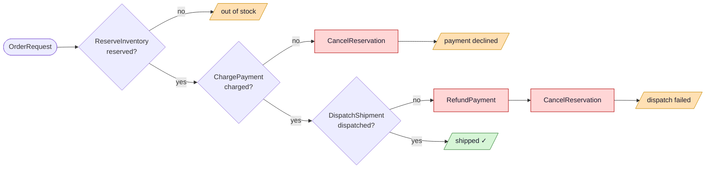

Each failure branch runs **compensating activities** before completing — the
nested `if/else` in `run` *is* this diagram. Durable replay survives crashes.

---

## 7 · Workflows — activities & the driver

```scala
class ReserveInventory(using JsonCodec[OrderRequest], JsonCodec[ReservationResult])
    extends WorkflowActivity[OrderRequest, ReservationResult]:
  def execute(req: OrderRequest)(using DaprCapability): ReservationResult =
    ReservationResult(req.quantity <= 5, s"RES-${req.orderId}")   // no field capture!
```

```scala
def processOrder(order: OrderRequest, name: WorkflowName, timeout: FiniteDuration)
                (using DaprCapability, ...): ProcessOrderResult =
  DaprCapability.workflow:
    val id = WorkflowCapability.start(name, order)
    WorkflowCapability.waitForCompletion(id, timeout) match
      case None       => ProcessOrderResult(order.orderId, timedOut = true, None)
      case Some(snap) => ... snap.serializedOutput.flatMap(_.decode[OrderResult].toOption)
```

`callActivity` returns a `Task[O]` that **captures the `WorkflowContext`**
(`Task[O]^{ctx}`). Capture checking forbids it from escaping `run` — you can't
stash it in a field or outer `var` and `.await()` it later, when scheduling would
no longer be deterministic. The `Task` lives and dies inside the run.

---

## 8 · Cryptography — wrap/unwrap inside a scope

```scala
object CryptographyDemoApp:
  def apply()(using DaprCapability): CryptoResult =
    DaprCapability.crypto(CryptoComponentName("localstorage")):
      val cipher    = CryptoCapability.encryptString(RsaKey, plaintext, KeyWrapAlgorithm.Rsa)
      val decrypted = CryptoCapability.decryptString(cipher)        // key ref rides in the ciphertext

      val data       = Charsets.encodeString("payload-bytes", Charsets.Utf8)
      val cipherBytes = CryptoCapability.encrypt(RsaKey, data, KeyWrapAlgorithm.Rsa)
      CryptoResult(plaintext, cipher.size, decrypted, CryptoCapability.decrypt(cipherBytes) == data)
```

`CryptoCapability` is **exclusive** to the `crypto(...)` scope. Payloads are
immutable `ArraySeq[Byte]`; `decrypt` reads the key reference embedded in the
ciphertext, so it needs only the bytes.

---

## 9 · Jobs — schedule now, fire later (both halves)

```scala
def scheduleDemo(payload: String)(using JobsCapability, JsonCodec[String]): String =
  JobsCapability.scheduleOnce(DemoJob, payload, Instant.now().plusSeconds(2)); payload

def onJobFired(payload: String)(using StateCapability, JsonCodec[String]): Unit =
  StateCapability.save(resultKey, payload)              // the trigger lands here

DaprCapability.state(StateStore): DaprCapability.jobs:
  DaprApp(
    invocations = List(InvocationRoute[String, String](MethodName("schedule"))(scheduleDemo)),
    jobs        = List(JobRoute[String](DemoJob)(onJobFired)),   // sidecar POSTs to /job/demo-job
  )
```

The **client** asks the scheduler to fire later; the **trigger** is just another
typed route. Both lambdas capture their capability from the enclosing scope.

---

## 10 · Conversation — a multi-message exchange

```scala
object ConversationDemoApp:
  def apply()(using DaprCapability): ConversationDemoResult =
    DaprCapability.conversation(ConversationComponentName("echo")):
      val resp = ConversationCapability.converse(Seq(
        ConversationMessage.system("be terse"),
        ConversationMessage.user("hello world"),       // roles, tools, usage — all typed
      ))
      val reply = resp.outputs.headOption.flatMap(_.choices.headOption).map(_.message.content)
      ConversationDemoResult(reply)
```

`converse` takes typed `ConversationMessage`s (roles, optional tool calls) and
returns choices + token usage. The `echo` component echoes each prompt back, so
the demo is deterministic with no real LLM provider.

---

## 11 · Bindings — output & input, one bidirectional connector

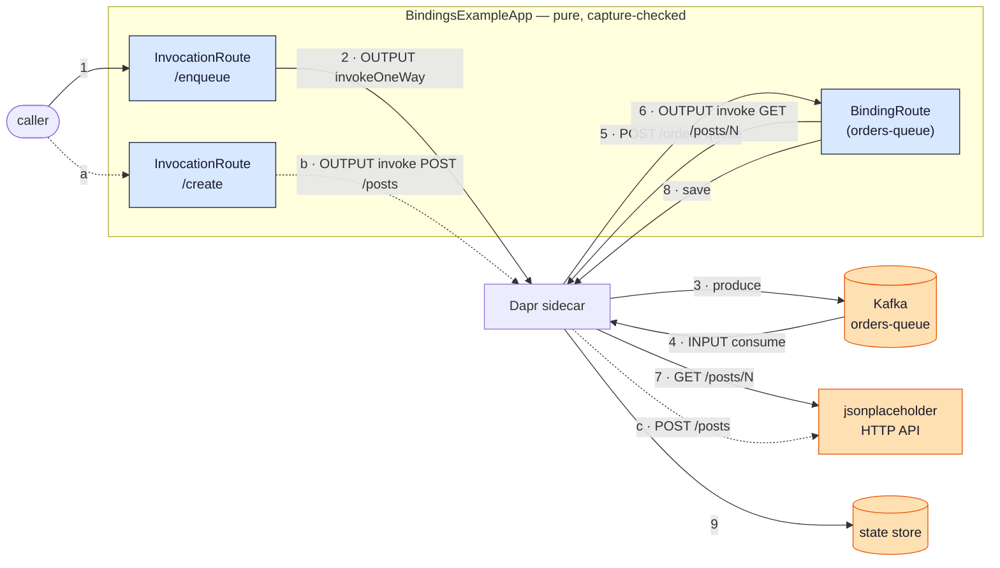

**Output** = `BindingsCapability` (you call it); **input** = a `BindingRoute` (it
calls you). The numbered solid path **1→9** is the round-trip: `/enqueue` produces
to Kafka (**2–3**), the sidecar delivers it back to the `BindingRoute` (**4–5**),
which fetches the post over the HTTP binding (**6–7**) and persists it (**8–9**) —
so the same Kafka `orders-queue` binding is *both* output and input. The dashed
path **a→c** is the standalone `/create` output call. Two bindings share one type,
so they're plain `val`s (not `given`s) — no ambiguous implicit.

---

## 11 · Bindings — the code

```scala
val ordersQueue     = cap.binding(OrdersQueue)      // Kafka — bidirectional
val jsonPlaceholder = cap.binding(JsonPlaceholder)  // HTTP  — output (jsonplaceholder.typicode.com)

DaprCapability.state(StateStore):
  DaprApp(
    invocations = List(
      InvocationRoute[PostRef, String](MethodName("enqueue")): ref =>
        ordersQueue.invokeOneWay(BindingOperation("create"), ref)       // OUTPUT → Kafka
        s"enqueued post ${ref.postId}",
    ),
    bindings = List(                                                     // INPUT ← Kafka
      BindingRoute[PostRef](OrdersQueue): ref =>
        jsonPlaceholder.invoke(BindingOperation("get"), "", pathMeta(s"/posts/${ref.postId}"))[Post]  // OUTPUT → HTTP
          .foreach(post => StateCapability.save(postKey(post.id), post)),
    ),
  )
```

---

## Running any example

```bash
# one-time: publish dapr4s locally
cd ../scala-safe-dapr && scala-cli --power publish local .

# need Redis for state/pubsub/lock
docker run -d -p 6379:6379 redis:7

# run an example under its sidecar
dapr run --app-id hello-state \
         --components-path ./components \
         -- mill 01-hello-state-shell.run
```

Components are **YAML in `components/`** — swap Redis for any backend without
touching a line of Scala. Multi-process examples (pub/sub, invocation, actors,
workflows) run a server + a driver in two terminals.

---

<!-- _class: section-break -->

# Part 5½
## Two real-world case studies

*The thirteen examples are each one building block. Real systems compose several —
across several services. Here are two, modelled on production Dapr users.*

---

## Why these two?

Dapr's own adopter list includes both. They stress **different** halves of the model:

| | **Grafana** scan pipeline | **ZEISS** order fulfillment |
|---|---|---|
| Shape | event-driven **fan-out** | request/response **saga** |
| Core block | **pub/sub** + state | **workflow** + service invocation |
| Hard part | at-least-once, dedup, **DLQ** | **compensation** across services |
| Services | 3 (gateway · worker · results) | 4 (order · inventory · payment · shipping) |
| Lives in | mostly **pure** handlers | **pure** saga (per-call capability) |

Both ship as **multiple modules** in `dapr4s-examples` — one per microservice.

---

<!-- _class: section-break -->

# Case study 1
## 12 · Grafana — vulnerability scan pipeline

---

## The real system, in one diagram

Grafana scans every container image they ship for CVEs. Images arrive on a queue,
a worker fleet scans them, results feed a dashboard. The pipeline must be
**idempotent** (the queue is at-least-once) and **resilient** (scans flake).

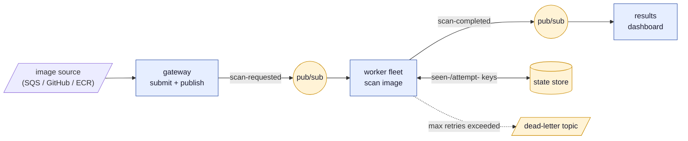

Three modules — `12-scan-gateway`, `12-scan-worker`, `12-scan-results` — plus a
shell each. The fan-out (one topic, many workers) is **Dapr config, not code**.

---

## The five concerns → Dapr building blocks

| Concern | Without Dapr | In this pipeline |
|---|---|---|
| **Ingestion** | SQS SDK in every service | input binding / `publish` to a topic |
| **Fan-out** | broker client + consumer groups | `Subscription` on `scan-requested` |
| **Idempotency** | dedup table you maintain | `seen-<scanId>` marker in state store |
| **Retry** | hand-rolled backoff | return `SubscriptionResult.Retry` |
| **Dead-letter** | poison-message queue plumbing | `deadLetterTopic` on the `Subscription` + a DLQ subscriber |

The worker's handler is **pure business logic** over capabilities. The broker and
the retry policy stay in config; the dead-letter **topic** is declared right on the
`Subscription`, and a small DLQ subscriber on the results side tallies the poison
messages the sidecar routes there.

---

## Five concerns, mapped to building blocks

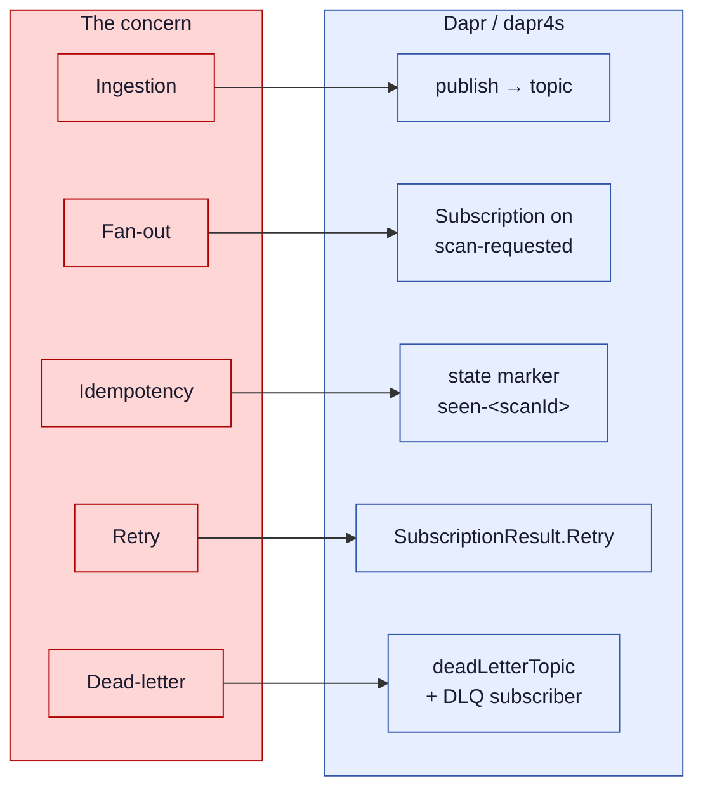

Every left-hand concern that you'd normally hand-roll becomes a **declared
building block** — config or one typed value, not bespoke plumbing.

---

## The gateway — publish on the edge (pure)

```scala
def submit(req: ScanRequest)(using PubSubCapability, JsonCodec[ScanRequest]): SubmitResponse =
  PubSubCapability.publish(ScanRequestedTopic, req)
  SubmitResponse(accepted = true, req.scanId)

object GatewayApp:
  def apply()(using DaprCapability, JsonCodec[ScanRequest], JsonCodec[SubmitResponse]): DaprApp =
    DaprCapability.pubsub(PubSubComponent):
      DaprApp(invocations =
        List(InvocationRoute[ScanRequest, SubmitResponse](MethodName("submit"))(submit)))
```

A caller `POST`s an image; the gateway publishes it and acks. The seed driver
stands in for the SQS binding — it even publishes a **duplicate** `scan-3` and a
`"flaky"` source so the worker's dedup and retry paths get exercised end-to-end.

---

## The worker — idempotency, retry, DLQ (pure)

```scala
def onScanRequested(event: CloudEvent[ScanRequest])(using
    StateCapability, PubSubCapability, JsonCodec[SeenMarker], JsonCodec[Int], JsonCodec[ScanResult]
): SubscriptionResult =
  val req = event.data
  if StateCapability.get[SeenMarker](seenKey(req.scanId)).isDefined then
    SubscriptionResult.Drop                                  // already done — discard
  else if req.source == "poison" then
    SubscriptionResult.Retry                                 // never succeeds → sidecar dead-letters it
  else
    val attempts = StateCapability.get[Int](attemptKey(req.scanId)).getOrElse(0)
    StateCapability.save(attemptKey(req.scanId), attempts + 1)
    if req.source == "flaky" && attempts == 0 then
      SubscriptionResult.Retry                               // transient — Dapr retries (Resiliency policy)
    else
      PubSubCapability.publish(ScanCompletedTopic, scan(req))
      StateCapability.save(seenKey(req.scanId), SeenMarker(req.scanId))
      SubscriptionResult.Success                             // ack

// the dead-letter topic is declared on the Subscription, not in the handler:
Subscription[ScanRequest](PubSubComponent, ScanRequestedTopic,
                          deadLetterTopic = Some(DeadLetterTopic))(onScanRequested)
```

`Drop` / `Retry` / `Success` are the **only** three answers — the type makes the
at-least-once contract explicit. A Dapr **Resiliency** policy (`components/resiliency.yaml`
— config, not Scala) drives redelivery: with the Redis pub/sub component a `Retry` is
re-invoked **inline** by resiliency. Once a request exhausts the policy's retries the
sidecar routes it to `deadLetterTopic`, where the results service tallies it.

---

## The worker's three answers, as a flow

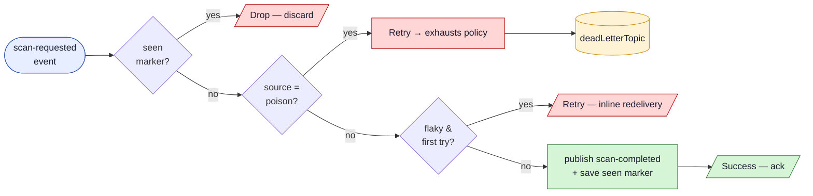

`Drop` · `Retry` · `Success` are the **only** three answers — the return type
makes the at-least-once contract impossible to get wrong by accident.

---

<!-- _class: section-break -->

# Case study 2
## 13 · ZEISS — order fulfillment saga

---

## The real system: a saga across microservices

ZEISS coordinates orders across independent services. Each step can fail, and a
failed step must **undo** the ones before it. A durable Dapr Workflow drives the
orchestration; each activity makes one **service-invocation** call downstream.

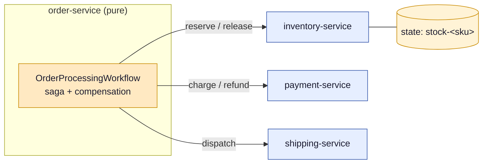

Four modules — `13-order-service` (the saga) plus `13-inventory-service`,
`13-payment-service`, `13-shipping-service`. They agree by **JSON on the wire**;
each owns its own copy of the contract.

---

## The saga as a state machine

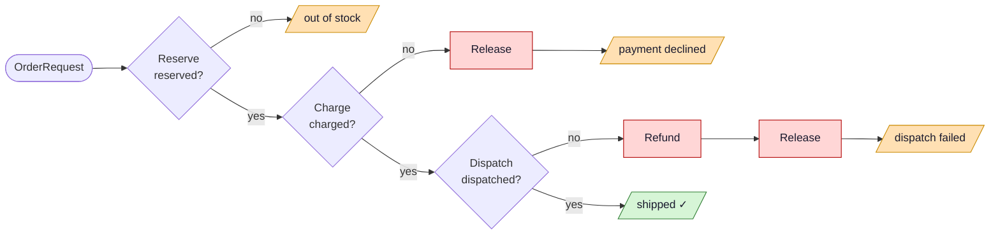

Unlike example 7 (a self-contained saga), **every box here is a real network
call** to another service. Durable replay means a crash mid-saga resumes — and
the compensations still run.

---

## Why this whole saga stays *pure*

`WorkflowActivity.execute` receives a `DaprCapability` **per call** — the runtime
hands it in for the duration of the invocation. Nothing is captured into a field,
nothing is **stored** in the long-lived `List[WorkflowActivity]`, so **safe mode
accepts the activities as-is** — no `@assumeSafe`:

```scala
class ReserveActivity(using JsonCodec[OrderRequest], JsonCodec[ReservationResult],
                            JsonCodec[ReserveRequest])
    extends WorkflowActivity[OrderRequest, ReservationResult]:
  def execute(o: OrderRequest)(using DaprCapability): ReservationResult =
    DaprCapability.invoker:
      ServiceInvocationCapability.invoke[ReserveRequest](
        InventoryService, MethodName("reserve"),
        ReserveRequest(o.orderId, o.sku, o.quantity))[ReservationResult]
```

The **pure** `13-order-service` module holds the entire saga — DTOs, activities,
the orchestration, and the workflow-client driver. The **shell** keeps only what
safe mode genuinely rejects: the upickle codec derivations and the `@main` entry
points.

---

## The orchestration & its compensations (pure)

```scala
class OrderProcessingWorkflow extends Workflow:
  def run(using WorkflowContext): Unit =
    val order = WorkflowContext.getInput[OrderRequest].getOrElse(throw RuntimeException("no input"))
    val reservation = WorkflowContext.callActivity[ReserveActivity](order).await()
    if !reservation.reserved then WorkflowContext.complete(OrderResult(false, "out of stock"))
    else
      val payment = WorkflowContext.callActivity[ChargeActivity](order).await()
      if !payment.charged then
        WorkflowContext.callActivity[ReleaseActivity](releaseOf(reservation, order)).await()  // compensate
        WorkflowContext.complete(OrderResult(false, "payment declined"))
      else ... // dispatch, else refund + release, else "shipped ✓"
```

The nested `if/else` **is** the state-machine diagram. Each `callActivity` returns
a `Task[O]` that captures the exclusive `WorkflowContext` (`Task[O]^{ctx}`), so
capture checking forbids it from escaping `run`. The whole state machine stays
inside the run — that's what keeps replay deterministic.

---

## What the two case studies prove

- dapr4s composes to **multi-service systems**, not just single building blocks —
  7 microservices across 14 modules, all in the same checked model.
- The **pure handler** is the common case: Grafana's whole pipeline is pure logic
  over capabilities; the broker and retry policy stay in config, the dead-letter
  topic is one field on the `Subscription`.
- The **shell** absorbs exactly what safe mode rejects — here, just the upickle
  codec derivations and the `@main` entry points.
- The **pure/shell boundary is principled**, not arbitrary: even a saga that hits
  the network at every step stays pure, because `execute` takes its
  `DaprCapability` per call instead of capturing one.

> Same compiler guarantees, real production shapes.

---

<!-- _class: section-break -->

# Part 6
## The payoff

---

## What the compiler now guarantees

Before, these were code-review comments. Now they're **compile errors**:

- A Dapr client **cannot be used after its scope closes** — `^{this}` lifetimes
- A capability **cannot escape** into a stored closure or another thread
- A handler's request/response **types match the wire contract** — `InvocationRoute[In,Out]`
- `Task[O]` from a workflow **cannot be awaited outside the run** — replay-safe
- A `Topic` **cannot be passed where a `StoreName` is expected** — opaque types
- I/O **cannot hide** inside "pure" business logic — safe mode + `@rejectSafe`

> The illegal program doesn't fail in production. It **doesn't compile.**

---

## A wall of compile errors

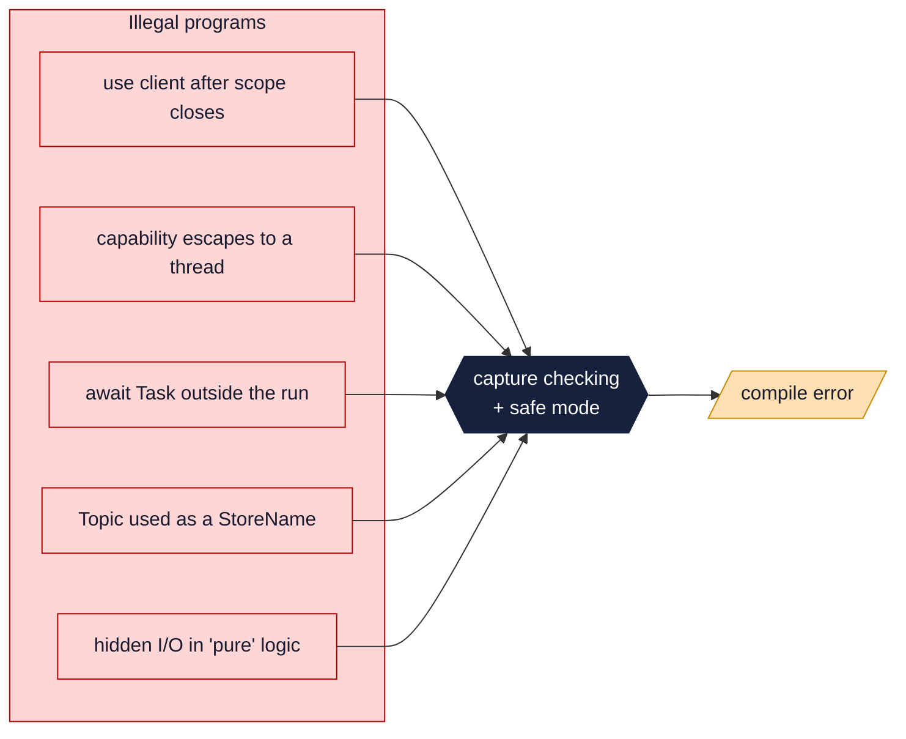

The five classic distributed-systems mistakes all hit the same wall — and bounce
off as a red squiggle in your editor, not a 3 a.m. page.

---

## Where dapr4s sits vs. effect libraries

| | Approach | Effects in types |
|---|---|---|
| **Cats Effect / ZIO** | monadic `IO[A]` / `ZIO[R,E,A]` | yes, wrapped value |
| **Kyo** | algebraic effects, `A < S` | yes, pending set |
| **Ox** | direct-style, structured concurrency | via capture checking |
| **dapr4s** | **direct-style + capture checking** | **yes, via `^` captures** |

dapr4s is **direct style**: ordinary code, ordinary control flow, no `for`-comprehension
monad tax — but the *capabilities* are tracked. No effect-runtime dependency;
blocking calls under the hood, ready for **JVM virtual threads**.

---

## Two roads to "effects in types"

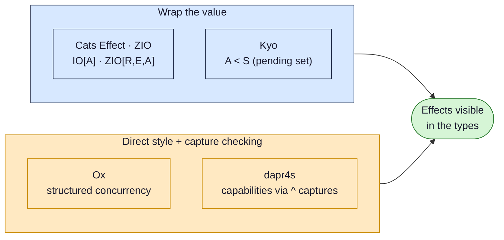

Same destination, different ergonomics. dapr4s takes the **direct-style** road —
plain control flow, effects tracked by `^` captures instead of a monad.

---

## Honest trade-offs & current status

- Built on **Scala 3.9 nightly** capture checking — *experimental*, syntax still moving
- The trusted core needs `@assumeSafe` at every Java/macro boundary
  - Mitigated: it's small, audited, and **one place per shell** in the examples
- Capture checking has rough edges (compile-time blowups with many opaque types;
  `CanThrow` interactions with sibling lambdas)
- Library scope: **12 building blocks**, 115 unit tests; actor *server* hosting and
  some workflow I/O encoding are still maturing
- Blocking API today — a fine fit for **virtual threads**, not yet async-native
- It attacks **accidental** complexity — client lifetimes, effect leaks, wire-type
  drift. The **essential** state of your domain still lives in the state store and
  your data model; no type system makes that go away (as the *Tar Pit* critics note)

> The *direction* — effects the compiler can prove — is the durable idea here.

---

## Takeaways

1. **Dapr** moves the hard distributed plumbing into a sidecar — and out of your code.
2. **Safe Scala** (capture checking + safe mode) makes effects and resource
   lifetimes **visible to the type system**.
3. **dapr4s** marries them: a **pure, checked core** of business logic over a
   **small, quarantined impure shell**.
4. It's not a toy — the thirteen examples cover every building block, and **two
   real-world case studies** (Grafana's scan pipeline, ZEISS's order saga)
   compose them into multi-service systems.
5. The payoff: a whole class of distributed-systems bugs becomes a **compile error**.

> *Out of the Tar Pit* named the disease — accidental complexity from **state** and
> **control**. dapr4s is one concrete prescription: lift it into a sidecar, pin the
> rest to the types.

---

<!-- _class: section-break -->

# Thank you
## Questions?

`github.com/sideeffffect/dapr4s` · examples: `dapr4s-examples`
docs.dapr.io · scala-lang.org capture checking

---

## Resources

- **Dapr** — docs.dapr.io · building blocks, components, sidecar
- **Capture Checking** — Scala 3 docs: capturing types, safe exceptions, safe mode
- **Foundations** — Odersky et al., *CF<: calculus* (TOPLAS 2023);
  *Capabilities for Safe AI Agents* (EPFL 2026)
- **Effect-systems landscape** — Kyo, Ox, Gears, Effekt; Cats Effect & ZIO
- **Type-driven design** — King, *Parse, Don't Validate*; nrinaudo, *Scala Best Practices*
- **Complexity** — Moseley & Marks, *Out of the Tar Pit* (2006) — essential vs. accidental, state & control
- **dapr4s** — `DESIGN.md`, `SPEC.allium`, and the `wiki/` knowledge base in the repo

<span class="small">Examples and the dapr4s library target Scala 3.9 nightly with experimental capture checking enabled.</span>
